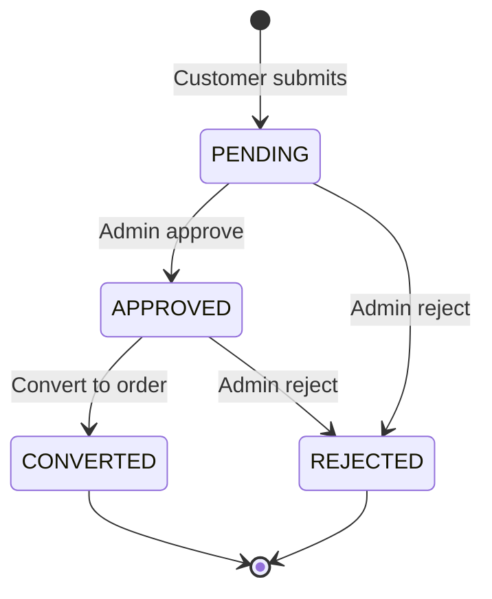

# Customization Requests API

Logged-in customers submit furniture customization requests (optional wood / polish / fabric, description, reference image, shipping address). Staff approve or reject, then convert approved requests into an inactive product + `PENDING` order with a Razorpay payment link to share with the customer.

[← Back to index](./README.md) · [Orders](./orders.md) · [Products](./products.md) · [Woods](./woods.md) · [Fabrics](./fabrics.md) · [Uploads](./uploads.md)

---

## Overview

```text
1. POST /uploads/customization-images          → R2 reference image (customer)
2. POST /customization-requests                 → create request (customer JWT)
3. GET  /admin/customization-requests           → staff inbox
4. POST /admin/customization-requests/:id/approve | reject
5. POST /admin/customization-requests/:id/convert-to-order
     → inactive Product + Order PENDING + Razorpay payment link
6. Admin shares paymentLinkUrl → customer pays → normal order webhook flow
```

### Status lifecycle

| Status | Meaning |
|--------|---------|
| `PENDING` | New request awaiting staff review |
| `APPROVED` | Staff approved; ready to convert |
| `REJECTED` | Staff rejected (optional reason) |
| `CONVERTED` | Inactive product + order created; linked via `productId` / `orderId` |



### Convert behaviour

- Creates a **Product** with `isActive: false` (hidden from storefront lists)
- Creates an **Order** in `PENDING` (awaiting payment) with one line item at the admin-set price
- Creates a **Razorpay payment link**; response includes `paymentLinkUrl` for the admin to share
- Optional: copy the request reference image onto the product when `useReferenceImageAsProductImage: true`
- Admin may override product name, quantity, and catalog picks on convert
- After payment succeeds, the usual order lifecycle continues (`CONFIRMED` → …)

---

## Who can access?

| Endpoint | Auth / permission |
|----------|-------------------|
| `POST /uploads/customization-images` | Customer JWT |
| `POST /customization-requests` | Customer JWT |
| `GET /customization-requests` | Customer JWT (own only) |
| `GET /customization-requests/:id` | Customer JWT (own only) |
| `GET /admin/customization-requests` | Staff (`view-customization-requests`) |
| `GET /admin/customization-requests/:id` | Staff (`view-customization-requests`) |
| `PATCH /admin/customization-requests/:id` | Staff (`update-customization-requests`) |
| `POST .../approve` | Staff (`update-customization-requests`) |
| `POST .../reject` | Staff (`update-customization-requests`) |
| `POST .../convert-to-order` | Staff (`update-customization-requests`) |

`SUPER_ADMIN` has `all`. Seeded `ADMIN` includes both view and update permissions. `ORDER_MANAGER` does **not**.

---

## Endpoints

| Method | Endpoint | Auth | Status |
|--------|----------|------|--------|
| `POST` | `/api/v1/uploads/customization-images` | Customer | `201` |
| `POST` | `/api/v1/customization-requests` | Customer | `201` |
| `GET` | `/api/v1/customization-requests` | Customer | `200` |
| `GET` | `/api/v1/customization-requests/:id` | Customer | `200` |
| `GET` | `/api/v1/admin/customization-requests` | Staff | `200` |
| `GET` | `/api/v1/admin/customization-requests/:id` | Staff | `200` |
| `PATCH` | `/api/v1/admin/customization-requests/:id` | Staff | `200` |
| `POST` | `/api/v1/admin/customization-requests/:id/approve` | Staff | `200` |
| `POST` | `/api/v1/admin/customization-requests/:id/reject` | Staff | `200` |
| `POST` | `/api/v1/admin/customization-requests/:id/convert-to-order` | Staff | `201` |

---

## POST /api/v1/uploads/customization-images

Two-phase upload (same pattern as support images). Returns `{ url, key, contentType, size }`. Attach `url` + `key` as `referenceImage.storageKey` on create/update.

---

## POST /api/v1/customization-requests

| | |
|---|---|
| **Auth** | Customer JWT |
| **Status** | `201` |

### Body

| Field | Type | Required | Rules |
|-------|------|----------|-------|
| `productName` | string | Yes | Non-empty, max 120 |
| `description` | string | Yes | Non-empty, max 2000 |
| `shippingAddressId` | number | Yes | Must belong to the customer |
| `quantity` | number | No | Min 1, default `1` |
| `woodId` | number | No | Existing wood catalog ID |
| `polishId` | number | No | Must belong to `woodId` (requires `woodId`) |
| `fabricId` | number | No | Existing fabric catalog ID |
| `referenceImage` | object | No | `{ url, storageKey? }` from upload endpoint |

### Example

```json
{
  "productName": "Custom teak dining table",
  "description": "6-seater with marble inlay",
  "shippingAddressId": 1,
  "quantity": 1,
  "woodId": 1,
  "polishId": 2,
  "fabricId": 3,
  "referenceImage": {
    "url": "https://cdn.example.com/customization-requests/2026/07/abc.webp",
    "storageKey": "customization-requests/2026/07/abc.webp"
  }
}
```

---

## GET /api/v1/customization-requests

Paginated list of the authenticated customer’s requests. Query: `page`, `limit`, optional `status`.

---

## Admin list / detail

`GET /api/v1/admin/customization-requests?page=1&limit=10&status=PENDING`

Detail includes customer phone, shipping address, catalog joins (`wood`, `polish`, `fabric`), and linked `product` / `order` when converted.

---

## PATCH /api/v1/admin/customization-requests/:id

Edit while status is not `CONVERTED`. Fields: `productName`, `description`, `quantity`, `woodId`, `polishId`, `fabricId`, `referenceImage` (pass `null` to clear image). Clearing `woodId` also clears `polishId`.

Use existing wood / polish / fabric admin APIs to add missing catalog entries first, then attach them here.

---

## POST .../approve

`PENDING` → `APPROVED`. Records `reviewedAt` / `reviewedByStaffId`.

---

## POST .../reject

Body (optional): `{ "reason": "…" }`.

`PENDING` or `APPROVED` → `REJECTED`.

---

## POST .../convert-to-order

Only when status is `APPROVED`.

### Body

| Field | Type | Required | Rules |
|-------|------|----------|-------|
| `price` | number | Yes | Selling price (≥ 0) |
| `subCategoryId` | number | Yes | Sub-category for the inactive product |
| `productName` | string | No | Override request name |
| `quantity` | number | No | Override request quantity (min 1) |
| `useReferenceImageAsProductImage` | boolean | No | Default `false` |
| `woodId` / `polishId` / `fabricId` | number | No | Override catalog picks |
| `shippingAmount` | number | No | Default `0` |
| `billingAddressId` | number | No | Defaults to request shipping address |

### Example response `data`

```json
{
  "request": { "id": 1, "status": "CONVERTED", "productId": 50, "orderId": 12 },
  "order": {
    "id": 12,
    "orderNumber": "ORD-20260728-0001",
    "status": "PENDING",
    "totalAmount": "45999.00",
    "productId": 50
  },
  "product": {
    "id": 50,
    "name": "Custom teak dining table",
    "slug": "custom-teak-dining-table-custom-abc",
    "price": "45999",
    "isActive": false
  },
  "paymentLinkUrl": "https://rzp.io/i/example"
}
```

Share `paymentLinkUrl` with the customer. After payment, Razorpay webhooks confirm the order as usual.

---

## Notes

- Customer is already created via OTP login; convert uses `request.customerId` (no separate customer create).
- Inactive custom products do not appear in default public `GET /products`.
- Convert builds the order internally (bypasses the storefront “product must be active” checkout check).
- `OrderItem` snapshots wood name/color when wood is set; polish/fabric remain on the request and product relations.
