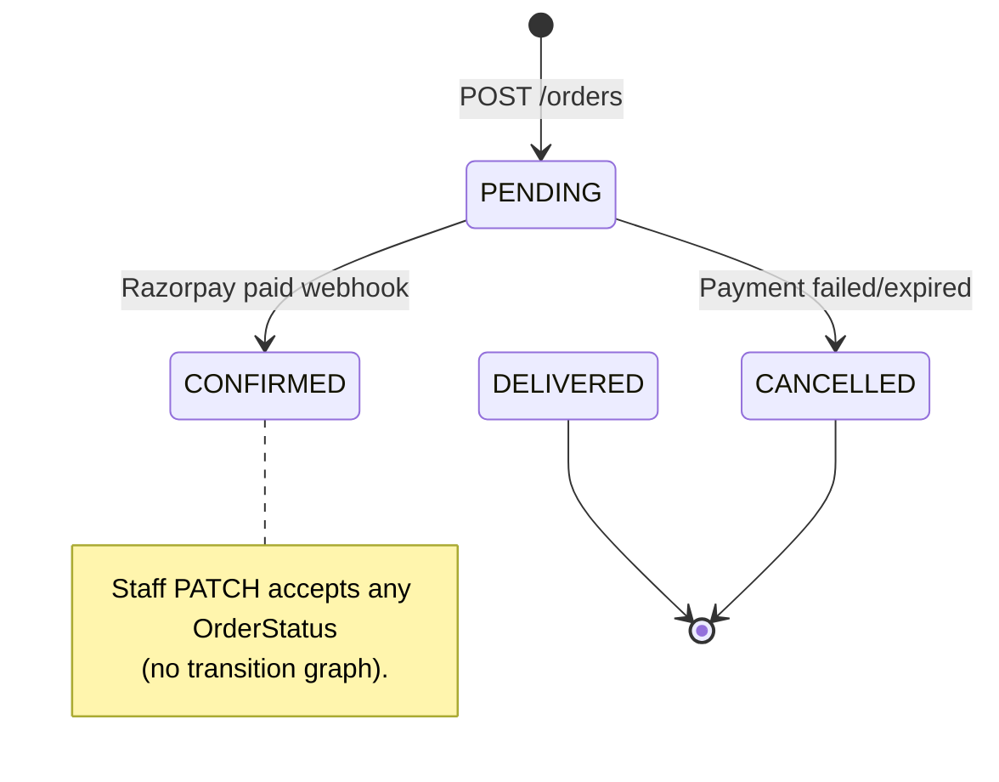

# Orders API

Checkout from frontend cart, Razorpay payment links, order tracking, and staff order management.

[← Back to index](./README.md) · [Customers](./customers.md) · [Addresses](./addresses.md) · [Cart](./cart.md) · [Payments](./payments.md) · [Refunds](./refund.md) · [Invoices](./invoices.md) · [Order Support](./order-support.md)

---

## Overview

- **Backend cart** — see [cart.md](./cart.md); `GET/PATCH /cart` for logged-in customers
- **Checkout** — send `items` in the body (legacy) or `useCart: true` to charge the saved server cart
- **Server-side pricing** — totals are computed from database product prices; frontend prices are never trusted
- **Stock is decremented** atomically when the order is created
- **Stock is restored** when payment fails/expires (webhook) or staff cancels an order
- Each order gets a human-readable `orderNumber` (e.g. `ORD-20260710-0001`)
- A `Payment` record and **Razorpay Payment Link** are created at checkout
- **Order tracking timeline** — each status change is stored in `order_status_events` and exposed via `GET /orders/:id/tracking`
- **Customer emails (Resend)** — transactional emails on confirm / ship / deliver (see below)

### Customer emails (Resend)

When `RESEND_API_KEY` is set (and `RESEND_ENABLED` is not `false`), the API sends HTML emails to the shipping address email (billing email as fallback; also parses email from the address snapshot if the live address field is empty). Missing email → skipped (logged). Failures never block the order API. Invoice PDF generation failures no longer block the order-received email.

| Event | When |
|-------|------|
| Order received / placed | Order becomes `CONFIRMED` (payment webhook or staff PATCH) |
| Order shipped | Staff sets status `SHIPPED` |
| Order delivered | Staff sets status `DELIVERED` |
| Order cancelled | Order becomes `CANCELLED` (payment failed/expired webhook, checkout link failure, or staff PATCH) |

Env: `RESEND_API_KEY`, `RESEND_FROM_EMAIL`, `RESEND_ENABLED`, optional `EMAIL_STORE_URL` for the “View order” CTA. Templates live in `src/modules/email/templates/`.

### Manual send (staff)

`POST /api/v1/orders/:id/emails` — requires `update-orders`.

```json
{ "type": "ORDER_PLACED" }
```

| `type` | Template |
|--------|----------|
| `ORDER_PLACED` | Order received / confirmed |
| `ORDER_SHIPPED` | Shipped |
| `ORDER_DELIVERED` | Delivered |
| `ORDER_CANCELLED` | Cancelled |
| `REFUND_INITIATED` | Refund started (uses latest refund amount, or body `refundAmount`) |
| `REFUND_COMPLETED` | Refund completed |

Recipient must exist on the order shipping/billing address or the API returns `400`.

### Order lifecycle



Status events are recorded automatically when:
- Order is placed (`PENDING`, system)
- Payment succeeds (`CONFIRMED`, system)
- Payment fails (`CANCELLED`, system)
- Staff updates status (`STAFF` actor)

### Checkout flow

```
Frontend localStorage cart
        ↓
POST /orders (items, shippingAddressId, billingAddressId?, couponCode?)
        ↓
Order (PENDING) + Payment (PENDING) + stock decremented + Razorpay link
        ↓
Customer pays via paymentLinkUrl
        ↓
Razorpay webhook → Order CONFIRMED + invoice (or CANCELLED + stock restored)
```

### Order statuses

| Status | Description |
|--------|-------------|
| `PENDING` | New order, awaiting Razorpay payment |
| `CONFIRMED` | Payment received; invoice generated on payment webhook (not on staff confirm) |
| `UNDER_PRODUCTION` | Product is under production / manufacturing |
| `PACKING` | Product packing in progress |
| `SHIPPED` | Order shipped |
| `DELIVERED` | Order delivered |
| `REFUND_INITIATED` | Legacy enum value — refunds no longer set this; use `Refund.status` / `?refundStatus=` |
| `PARTIALLY_REFUNDED` | Legacy enum value — refunds no longer set this |
| `REFUNDED` | Legacy enum value — full refund sets `Payment.status = REFUNDED` only; order status stays operational |
| `CANCELLED` | Order cancelled (payment failed / staff cancel); stock restored |

Refund lifecycle is tracked on `Refund.status` (`INITIATED` → `PROCESSING` → `PROCESSED` / `FAILED` / `CANCELLED`), not on `Order.status`. See [refund.md](./refund.md).

### Payment method

All orders use `RAZORPAY`. Payment method is set server-side — not sent in the checkout request.

### Who can access?

| Endpoint | Customer | SUPER_ADMIN | ADMIN | ORDER_MANAGER |
|----------|:--------:|:-----------:|:-----:|:-------------:|
| `POST /orders` | Yes | No | No | No |
| `GET /orders` | Own orders | All (`view-orders`) | All | All |
| `GET /orders/:id` | Own order | All (`view-orders`) | All | All |
| `GET /orders/:id/tracking` | Own order | All (`view-orders`) | All | All |
| `PATCH /orders/:id` | No | Yes | Yes | Status only |
| `POST /orders/:id/refund` | No | Yes (`update-payments`) | Yes | No |
| `POST /orders/:id/refund/:refundId/complete` | No | Yes (`update-payments`) | Yes | No |
| `POST /orders/:id/refund/:refundId/cancel` | No | Yes (`update-payments`) | Yes | No |
| `GET /orders/:id/refund` | No | Yes | Yes | No |
| `POST /orders/:id/emails` | No | Yes (`update-orders`) | Yes | Yes |
| `POST /orders/:id/invoice/generate` | No | Yes (`update-orders`) | Yes | Yes |
| `POST /orders/:id/invoice/email` | No | Yes (`update-orders`) | Yes | Yes |

Staff `PATCH` requires `update-orders`. Refunds are two-phase: initiate → complete (see [refund.md](./refund.md)).

---

## Endpoints

| Method | Endpoint | Auth | Status |
|--------|----------|------|--------|
| `POST` | `/api/v1/orders` | Customer | `201` |
| `GET` | `/api/v1/orders` | Customer or staff | `200` |
| `GET` | `/api/v1/orders/:id` | Customer or staff | `200` |
| `GET` | `/api/v1/orders/:id/tracking` | Customer or staff | `200` |
| `PATCH` | `/api/v1/orders/:id` | Staff (`update-orders`) | `200` |
| `POST` | `/api/v1/orders/:id/refund` | Staff (`update-payments`) | `201` |
| `POST` | `/api/v1/orders/:id/refund/:refundId/complete` | Staff (`update-payments`) | `200` |
| `POST` | `/api/v1/orders/:id/refund/:refundId/cancel` | Staff (`update-payments`) | `200` |
| `GET` | `/api/v1/orders/:id/refund` | Staff (`view-payments` or `view-orders`) | `200` |
| `POST` | `/api/v1/orders/:id/emails` | Staff (`update-orders`) | `200` |
| `GET` | `/api/v1/orders/:id/audit-logs` | Staff (`view-orders`) | `200` |
| `GET` | `/api/v1/orders/:id/invoice` | Customer or staff | `200` |
| `POST` | `/api/v1/orders/:id/invoice/generate` | Staff (`update-orders`) | `200` |
| `POST` | `/api/v1/orders/:id/invoice/email` | Staff (`update-orders`) | `200` |
| `GET` | `/api/v1/orders/:id/invoice/pdf` | Customer or staff | `302` |
| `POST` | `/api/v1/orders/:id/support-tickets` | Customer | `201` |
| `GET` | `/api/v1/orders/:id/support-tickets` | Customer or staff | `200` |

See [order-support.md](./order-support.md) for the full support ticket API.

---

## POST /api/v1/orders

Create an order from frontend cart items. Creates a Razorpay Payment Link for the order total.

| | |
|---|---|
| **Auth** | Bearer (customer JWT) |
| **Status** | `201` |

### Request body

```json
{
  "items": [
    { "productId": 1, "quantity": 2 },
    { "productId": 3, "quantity": 1 }
  ],
  "shippingAddressId": 1,
  "billingAddressId": 2,
  "couponCode": "SAVE500"
}
```

| Field | Type | Required | Rules |
|-------|------|----------|-------|
| `items` | array | Yes | Min 1 item |
| `items[].productId` | integer | Yes | Must exist and be active |
| `items[].quantity` | integer | Yes | Min 1, max 9999 |
| `shippingAddressId` | integer | Yes | Customer's own address |
| `billingAddressId` | integer | No | Defaults to `shippingAddressId` |
| `couponCode` | string | No | Max 32 chars; validated server-side |

### Validation rules

1. All addresses must belong to the authenticated customer
2. All products must exist and be `isActive: true`
3. Sufficient stock for each line item
4. `subtotalAmount` computed server-side from product prices
5. Optional coupon validated and discount applied
6. Shipping address pincode checked for serviceability ([shipping.md](./shipping.md)); `shippingAmount` computed from site settings
7. `totalAmount = subtotal - discount + shippingAmount`
8. Razorpay Payment Link created for full `totalAmount`

### Success response `201`

Same shape as `GET /orders/:id` (see [Order detail response](#order-detail-response)). Example immediately after checkout:

```json
{
  "success": true,
  "data": {
    "id": 1,
    "orderNumber": "ORD-20260710-0001",
    "customerId": 1,
    "addressId": 1,
    "billingAddressId": 2,
    "status": "PENDING",
    "subtotalAmount": "5000.00",
    "discountAmount": "500.00",
    "totalAmount": "4500.00",
    "coupon": {
      "id": 1,
      "code": "SAVE500",
      "type": "FLAT_CART"
    },
    "paymentMethod": "RAZORPAY",
    "shippingAddress": "123 Main Street, Apt 4B, Mumbai, Maharashtra, 400001, IN",
    "billingAddress": "456 Business Park, Mumbai, Maharashtra, 400002, IN",
    "createdAt": "2026-07-10T12:00:00.000Z",
    "updatedAt": "2026-07-10T12:00:00.000Z",
    "customer": {
      "id": 1,
      "phone": "9876543210",
      "isActive": true,
      "lastLogin": "2026-07-10T11:00:00.000Z"
    },
    "shippingAddressRef": {
      "id": 1,
      "type": "SHIPPING",
      "name": "John Doe",
      "email": "john@example.com",
      "phone": "9876543210",
      "line1": "123 Main Street",
      "line2": "Apt 4B",
      "city": "Mumbai",
      "state": "Maharashtra",
      "zipCode": "400001",
      "country": "IN",
      "isDefault": true
    },
    "billingAddressRef": {
      "id": 2,
      "type": "BILLING",
      "name": "John Doe",
      "email": "john@example.com",
      "phone": "9876543210",
      "line1": "456 Business Park",
      "line2": null,
      "city": "Mumbai",
      "state": "Maharashtra",
      "zipCode": "400002",
      "country": "IN",
      "isDefault": false
    },
    "items": [
      {
        "id": 1,
        "productId": 1,
        "quantity": 2,
        "price": "2500.00",
        "product": {
          "id": 1,
          "name": "Oak Dining Table",
          "slug": "oak-dining-table"
        }
      }
    ],
    "payment": {
      "id": 1,
      "amount": "4500.00",
      "status": "PENDING",
      "paymentMethod": "RAZORPAY",
      "transactionId": null,
      "notes": null,
      "paymentLinkUrl": "https://rzp.io/i/xxxx",
      "razorpayPaymentLinkId": "plink_xxxxxxxx",
      "razorpayPaymentId": null,
      "keyId": "rzp_test_xxxxxxxx",
      "razorpayOrderId": "order_xxxxxxxx",
      "amountPaise": 450000,
      "currency": "INR",
      "createdAt": "2026-07-10T12:00:00.000Z",
      "updatedAt": "2026-07-10T12:00:00.000Z"
    },
    "invoice": null
  }
}
```

> **Payment integration:** redirect the customer to `payment.paymentLinkUrl`. Poll `GET /orders/:id/tracking` or `GET /orders/:id` until `status` is no longer `PENDING`. See [payments.md](./payments.md) for webhooks and storefront notes.

### Payment object fields (on every order detail)

| Field | Type | Description |
|-------|------|-------------|
| `id` | integer | Internal payment ID |
| `amount` | string | Payable amount (matches order `totalAmount`) |
| `status` | string | `PENDING` \| `COMPLETED` \| `FAILED` \| `REFUNDED` |
| `paymentMethod` | string | Always `RAZORPAY` |
| `transactionId` | string \| null | Razorpay payment ID after success |
| `notes` | string \| null | Staff notes (set via `PATCH /orders/:id`) |
| `paymentLinkUrl` | string \| null | Razorpay hosted payment page — **use for redirect** |
| `razorpayPaymentLinkId` | string \| null | Razorpay payment link ID |
| `razorpayPaymentId` | string \| null | Set after successful payment |
| `keyId` | string | Razorpay public key (`RAZORPAY_KEY_ID`) |
| `razorpayOrderId` | string \| null | Razorpay order ID created at checkout |
| `amountPaise` | integer | Amount in paise (`amount × 100`, rounded) |
| `currency` | string | Always `INR` |
| `gatewayPayload` | object | **Staff only** — raw Razorpay webhook/link payload |
| `createdAt` | string | ISO timestamp |
| `updatedAt` | string | ISO timestamp |

### Errors

| Status | When |
|--------|------|
| `400` | Invalid payload, inactive product, or insufficient stock |
| `401` | Missing or invalid token |
| `403` | Staff token used (customer access required) |
| `404` | Address not found |
| `500` | Razorpay link creation failed (order cancelled, stock restored) |

### cURL

```bash
curl -X POST http://localhost:5000/api/v1/orders \
  -H "Authorization: Bearer $CUSTOMER_TOKEN" \
  -H "Content-Type: application/json" \
  -d '{
    "items": [{ "productId": 1, "quantity": 1 }],
    "shippingAddressId": 1
  }'
```

---

## GET /api/v1/orders

List orders with pagination.

| | |
|---|---|
| **Auth** | Bearer (customer or staff JWT) |
| **Status** | `200` |

### Query parameters

| Param | Type | Default | Description |
|-------|------|---------|-------------|
| `page` | integer | `1` | Page number |
| `limit` | integer | `10` | Items per page (max 100) |
| `status` | string | — | Filter by **operational** order status |
| `refundStatus` | string | — | Filter orders with at least one refund in this status (`INITIATED` \| `PROCESSING` \| `PROCESSED` \| `FAILED` \| `CANCELLED`) |
| `customerId` | integer | — | Staff only — filter by customer |
| `orderNumber` | string | — | Partial match on order number (e.g. `ORD-20260714-0011`) |
| `customerPhone` | string | — | Partial match on customer phone |
| `createdFrom` | string | — | ISO date/datetime — orders on/after this date |
| `createdTo` | string | — | ISO date/datetime — orders on/before this date |

> Customers always see only their own orders. `customerId` is ignored for customer tokens.
>
> Example: open refunds → `GET /orders?refundStatus=INITIATED`

### Success response `200`

List items are slim (use `GET /orders/:id` for full detail).

| Field | Type | Description |
|-------|------|-------------|
| `id` | integer | Internal order ID (for detail/tracking links) |
| `orderNumber` | string | Human-readable ID, e.g. `ORD-20260714-0021` |
| `totalAmount` | string | Order total |
| `customerPhone` | string | Customer phone number |
| `status` | string | Operational order status |
| `paymentStatus` | string \| null | Payment status |
| `activeRefundStatus` | string \| null | `INITIATED` or `PROCESSING` if an open refund exists |
| `latestRefundStatus` | string \| null | Status of the most recent refund row |
| `refundCount` | integer | Number of refund records |
| `createdAt` | string | ISO timestamp |

```json
{
  "success": true,
  "data": {
    "items": [
      {
        "id": 21,
        "orderNumber": "ORD-20260714-0021",
        "totalAmount": "5000.00",
        "customerPhone": "9876543210",
        "status": "SHIPPED",
        "paymentStatus": "COMPLETED",
        "activeRefundStatus": "INITIATED",
        "latestRefundStatus": "INITIATED",
        "refundCount": 1,
        "createdAt": "2026-07-14T12:00:00.000Z"
      }
    ],
    "meta": {
      "page": 1,
      "limit": 10,
      "total": 1,
      "totalPages": 1
    }
  }
}
```

```bash
# Example
curl "http://localhost:5000/api/v1/orders?page=1&limit=10" \
  -H "Authorization: Bearer <token>"
curl "http://localhost:5000/api/v1/orders?refundStatus=INITIATED" \
  -H "Authorization: Bearer <token>"
```

### cURL

```bash
# Customer — own orders
curl "http://localhost:5000/api/v1/orders?status=PENDING" \
  -H "Authorization: Bearer $CUSTOMER_TOKEN"

# Staff — filter examples
curl "http://localhost:5000/api/v1/orders?customerId=1" \
  -H "Authorization: Bearer $STAFF_TOKEN"

curl "http://localhost:5000/api/v1/orders?orderNumber=ORD-20260714-0011&customerPhone=98765&createdFrom=2026-07-01&createdTo=2026-07-14" \
  -H "Authorization: Bearer $STAFF_TOKEN"
```

---

## GET /api/v1/orders/:id

Get a single order with items, payment, address refs, invoice summary, and compact `refunds[]`.

| | |
|---|---|
| **Auth** | Bearer (customer or staff JWT) |
| **Status** | `200` |

Customers can only access their own orders. Detail also includes refund summary fields (`paymentStatus`, `activeRefundStatus`, `latestRefundStatus`, `refundCount`) and a compact `refunds` array for staff UI without a separate call.

### Success response `200`

Same structure as [POST /orders](#post-apiv1orders) success response. After payment, `status` is `CONFIRMED`, `payment.status` is `COMPLETED`, and `invoice` is populated:

```json
{
  "success": true,
  "data": {
    "id": 1,
    "orderNumber": "ORD-20260710-0001",
    "status": "CONFIRMED",
    "subtotalAmount": "5000.00",
    "discountAmount": "500.00",
    "totalAmount": "4500.00",
    "payment": {
      "id": 1,
      "amount": "4500.00",
      "status": "COMPLETED",
      "paymentMethod": "RAZORPAY",
      "transactionId": "pay_xxxxxxxx",
      "notes": null,
      "paymentLinkUrl": "https://rzp.io/i/xxxx",
      "razorpayPaymentLinkId": "plink_xxxxxxxx",
      "razorpayPaymentId": "pay_xxxxxxxx",
      "keyId": "rzp_test_xxxxxxxx",
      "razorpayOrderId": "order_xxxxxxxx",
      "amountPaise": 450000,
      "currency": "INR",
      "createdAt": "2026-07-10T12:00:00.000Z",
      "updatedAt": "2026-07-10T12:08:00.000Z"
    },
    "invoice": {
      "id": 1,
      "invoiceNumber": "INV-20260710-0001",
      "issuedAt": "2026-07-10T12:08:00.000Z",
      "totalAmount": "4500.00"
    }
  }
}
```

> Full field list: [Order detail response](#order-detail-response). Staff responses additionally include `payment.gatewayPayload`.

### Errors

| Status | When |
|--------|------|
| `404` | Order not found (or not owned by customer) |

### cURL

```bash
curl http://localhost:5000/api/v1/orders/1 \
  -H "Authorization: Bearer $CUSTOMER_TOKEN"
```

---

## GET /api/v1/orders/:id/tracking

Customer-facing order tracking timeline with step-by-step progress from order placed through delivery.

| | |
|---|---|
| **Auth** | Bearer (customer or staff JWT) |
| **Status** | `200` |

Customers can only access their own orders. Staff require `view-orders`.

### Success response

```json
{
  "success": true,
  "data": {
    "orderId": 1,
    "orderNumber": "ORD-20260711-0001",
    "currentStatus": "SHIPPED",
    "paymentStatus": "COMPLETED",
    "timeline": [
      {
        "status": "PENDING",
        "label": "Order placed",
        "description": "Waiting for payment",
        "isCompleted": true,
        "isCurrent": false,
        "occurredAt": "2026-07-11T12:05:00.000Z"
      },
      {
        "status": "CONFIRMED",
        "label": "Payment confirmed",
        "description": "Order is being prepared",
        "isCompleted": true,
        "isCurrent": false,
        "occurredAt": "2026-07-11T12:08:00.000Z"
      },
      {
        "status": "SHIPPED",
        "label": "Shipped",
        "description": "Order is on the way",
        "isCompleted": true,
        "isCurrent": true,
        "occurredAt": "2026-07-11T14:00:00.000Z"
      },
      {
        "status": "DELIVERED",
        "label": "Delivered",
        "description": "Order completed",
        "isCompleted": false,
        "isCurrent": false,
        "occurredAt": null
      }
    ]
  }
}
```

### Timeline step fields

| Field | Description |
|-------|-------------|
| `status` | `PENDING`, `CONFIRMED`, `SHIPPED`, `DELIVERED`, or `CANCELLED` |
| `label` | Customer-friendly step title |
| `description` | Short explanation for the storefront UI |
| `isCompleted` | Step has been reached |
| `isCurrent` | Active step right now |
| `occurredAt` | ISO timestamp when this status was recorded, or `null` |

### Storefront integration

- Poll `GET /orders/:id/tracking` every 3–5 seconds while `currentStatus === 'PENDING'` after Razorpay redirect
- Render a vertical stepper: completed steps, highlighted current step, grey future steps
- Use `paymentStatus` to show payment state alongside the timeline

### cURL

```bash
curl http://localhost:5000/api/v1/orders/1/tracking \
  -H "Authorization: Bearer $CUSTOMER_TOKEN"
```

---

## PATCH /api/v1/orders/:id

Staff order update with audit logging. **ADMIN** and **SUPER_ADMIN** can perform full corrections; **ORDER_MANAGER** can update **status only**.

| | |
|---|---|
| **Auth** | Bearer (staff JWT) |
| **Permission** | `update-orders` |
| **Status** | `200` |

### Role matrix

| Field | ADMIN / SUPER_ADMIN | ORDER_MANAGER |
|-------|---------------------|---------------|
| `status` | Yes | Yes |
| `shippingAddressId`, `billingAddressId` | Yes | No (`403`) |
| `items[]` | Yes | No |
| `payment.notes` | Yes | No |

### Request body

All fields optional; at least one required.

```json
{
  "status": "SHIPPED",
  "shippingAddressId": 1,
  "billingAddressId": 2,
  "items": [
    { "productId": 1, "quantity": 2 }
  ],
  "payment": {
    "notes": "Gift wrap requested"
  }
}
```

| Field | Type | Rules |
|-------|------|-------|
| `status` | string | Any `OrderStatus` value from the client (no transition rules). Examples: `PENDING` \| `CONFIRMED` \| `UNDER_PRODUCTION` \| `PACKING` \| `SHIPPED` \| `DELIVERED` \| `REFUND_INITIATED` \| `PARTIALLY_REFUNDED` \| `REFUNDED` \| `CANCELLED` |
| `shippingAddressId` | integer | Must belong to order customer; refreshes address snapshot |
| `billingAddressId` | integer | Must belong to order customer |
| `items` | array | Min 1 item; prices from DB; stock adjusted by delta |
| `payment.notes` | string | Staff notes on payment record |

### Restrictions

- Cannot edit `customerId`, `orderNumber`, `paymentMethod`, or Razorpay IDs
- Cannot edit items/addresses on `CANCELLED` or `DELIVERED` orders
- Cannot change items and cancel in the same request

### Side effects

| Change | Effect |
|--------|--------|
| → `CONFIRMED` | Order-received email sent; invoice is **not** auto-generated (use generate/email APIs) |
| → `CANCELLED` | Stock restored for all line items; cancelled email sent |
| `items` changed on confirmed order with invoice | Invoice regenerated |
| `items` changed | `totalAmount` and `payment.amount` recalculated; stock delta applied |

### Audit

All field changes are written to the audit log. See [admin-audit-logs.md](./admin-audit-logs.md) and `GET /orders/:id/audit-logs`.

### cURL

```bash
curl -X PATCH http://localhost:5000/api/v1/orders/1 \
  -H "Authorization: Bearer $STAFF_TOKEN" \
  -H "Content-Type: application/json" \
  -d '{"status":"SHIPPED"}'
```

---

## GET /api/v1/orders/:id/audit-logs

Paginated audit history for the order, line items, and payment notes.

| | |
|---|---|
| **Auth** | Bearer (staff JWT) |
| **Permission** | `view-orders` |
| **Status** | `200` |

### Query parameters

| Param | Type | Default | Description |
|-------|------|---------|-------------|
| `page` | integer | `1` | Page number |
| `limit` | integer | `20` | Items per page (max 100) |

### Success response `200`

```json
{
  "success": true,
  "data": {
    "items": [
      {
        "id": 1,
        "entityType": "ORDER",
        "entityId": 1,
        "parentEntityId": null,
        "fieldName": "status",
        "oldValue": "PENDING",
        "newValue": "CONFIRMED",
        "changedBy": { "id": 1, "email": "admin@chaaya.com", "firstName": "Super", "lastName": "Admin" },
        "createdAt": "2026-07-10T12:08:00.000Z"
      }
    ],
    "meta": {
      "page": 1,
      "limit": 20,
      "total": 1,
      "totalPages": 1
    }
  }
}
```

See [admin-audit-logs.md](./admin-audit-logs.md) for full audit log documentation.

---

## GET /api/v1/orders/:id/invoice

JSON invoice snapshot for a confirmed order. Returns `404` if no invoice exists yet (order still `PENDING`).

| | |
|---|---|
| **Auth** | Bearer (customer or staff JWT) |
| **Permission** | Staff: `view-orders`; customer: own order only |
| **Status** | `200` |

### Success response `200`

```json
{
  "success": true,
  "data": {
    "id": 1,
    "orderId": 1,
    "invoiceNumber": "INV-20260710-0001",
    "issuedAt": "2026-07-10T12:08:00.000Z",
    "billingName": "John Doe",
    "billingAddress": "456 Business Park, Mumbai, Maharashtra, 400002, IN",
    "subtotal": "5000.00",
    "discountAmount": "500.00",
    "taxAmount": "0.00",
    "totalAmount": "4500.00",
    "lineItems": [
      {
        "productId": 1,
        "name": "Oak Dining Table",
        "slug": "oak-dining-table",
        "quantity": 2,
        "unitPrice": "2500.00",
        "lineTotal": "5000.00"
      }
    ],
    "createdAt": "2026-07-10T12:08:00.000Z",
    "updatedAt": "2026-07-10T12:08:00.000Z",
    "order": {
      "orderNumber": "ORD-20260710-0001",
      "customer": { "id": 1, "phone": "9876543210" }
    }
  }
}
```

See [invoices.md](./invoices.md) for full invoice documentation, including
`POST /orders/:id/invoice/generate` and `POST /orders/:id/invoice/email`.

---

## Order detail response

All of `POST /orders` and `GET /orders/:id` return this shape (wrapped in `{ success, data }`). `GET /orders` returns the slim list shape above.

### Top-level fields

| Field | Type | Description |
|-------|------|-------------|
| `id` | integer | Order ID |
| `orderNumber` | string | Human-readable ID, e.g. `ORD-20260710-0001` |
| `customerId` | integer | Customer who placed the order |
| `addressId` | integer | Shipping address ID |
| `billingAddressId` | integer \| null | Billing address ID (`null` if same as shipping) |
| `status` | string | `PENDING` \| `CONFIRMED` \| `SHIPPED` \| `DELIVERED` \| `REFUND_INITIATED` \| `PARTIALLY_REFUNDED` \| `REFUNDED` \| `CANCELLED` |
| `subtotalAmount` | string | Sum of line items before discount |
| `discountAmount` | string | Coupon discount ( `0.00` if none) |
| `shippingAmount` | string | Shipping fee applied at checkout |
| `totalAmount` | string | `subtotalAmount - discountAmount + shippingAmount` |
| `coupon` | object \| null | `{ id, code, type }` or `{ code }` only, or `null` |
| `paymentMethod` | string | Always `RAZORPAY` |
| `shippingAddress` | string | Formatted address snapshot at checkout |
| `billingAddress` | string | Formatted billing snapshot |
| `createdAt` | string | ISO timestamp |
| `updatedAt` | string | ISO timestamp |
| `customer` | object | `{ id, phone, isActive, lastLogin }` |
| `shippingAddressRef` | object | Full address record (see below) |
| `billingAddressRef` | object | Full billing address record |
| `items` | array | Line items (see below) |
| `payment` | object \| null | Payment + Razorpay checkout fields (see [Payment object](#payment-object-fields-on-every-order-detail)) |
| `invoice` | object \| null | Summary after confirmation; `null` while `PENDING` |
| `orderReview` | object \| null | Overall order review if submitted (see below) |
| `productReviews` | array | Product reviews linked to this order |

### `items[]` fields

| Field | Type | Description |
|-------|------|-------------|
| `id` | integer | Order line item ID |
| `productId` | integer | Product ID |
| `quantity` | integer | Quantity ordered |
| `price` | string | Unit price at checkout (server-side) |
| `product` | object | `{ id, name, slug }` |
| `review` | object \| null | Product review for this line item if submitted for this order |

### Reviews on order detail

`orderReview` (overall order experience):

| Field | Type |
|-------|------|
| `id` | integer |
| `rating` | integer (`1`–`5`) |
| `comment` | string \| null |
| `isVisible` | boolean |
| `createdAt` | string |
| `updatedAt` | string |

`productReviews[]` / `items[].review`:

| Field | Type |
|-------|------|
| `id` | integer |
| `productId` | integer |
| `rating` | integer (`1`–`5`) |
| `comment` | string \| null |
| `isVisible` | boolean |
| `product` | `{ id, name, slug }` |
| `createdAt` | string |
| `updatedAt` | string |

See [reviews.md](./reviews.md) for create/update APIs. Reviews appear only after the customer submits them (typically once the order is `DELIVERED`).

### Address ref fields (`shippingAddressRef` / `billingAddressRef`)

| Field | Type |
|-------|------|
| `id` | integer |
| `type` | `SHIPPING` \| `BILLING` |
| `name` | string |
| `email` | string \| null |
| `phone` | string |
| `line1` | string |
| `line2` | string \| null |
| `city` | string |
| `state` | string |
| `zipCode` | string |
| `country` | string |
| `isDefault` | boolean |

### `invoice` summary (embedded on order detail)

| Field | Type | Description |
|-------|------|-------------|
| `id` | integer | Invoice ID |
| `invoiceNumber` | string | e.g. `INV-20260710-0001` |
| `issuedAt` | string | ISO timestamp |
| `totalAmount` | string | Invoice total |

For the full invoice JSON (line items, tax, billing name), use `GET /orders/:id/invoice`.

### Staff-only fields

Staff `GET /orders/:id` includes everything above plus:

| Field | Description |
|-------|-------------|
| `payment.gatewayPayload` | Raw Razorpay link/webhook payload (JSON) |

---

## Frontend integration notes

### localStorage cart shape (guest / legacy checkout)

```json
[
  { "productId": 1, "quantity": 2, "name": "Oak Table", "price": "24999.99" }
]
```

Only `productId` and `quantity` are sent to the API. Name and price in localStorage are for display only.

### Backend cart API (logged-in customers)

Full reference: [cart.md](./cart.md).

| Method | Endpoint | Description |
|--------|----------|-------------|
| `GET` | `/api/v1/cart` | Cart lines + `subtotalAmount` (live product prices) |
| `POST` | `/api/v1/cart/items` | Body `{ productId, quantity }` — upsert line |
| `PATCH` | `/api/v1/cart/items/:productId` | Body `{ quantity }` |
| `DELETE` | `/api/v1/cart/items/:productId` | Remove line |

Checkout with saved cart:

```json
{
  "useCart": true,
  "shippingAddressId": 1,
  "billingAddressId": 2,
  "couponCode": "SAVE500"
}
```

When `useCart` is `true`, `items` in the body are ignored. The cart is cleared after the order and payment link are created successfully. Coupon codes are applied only at checkout (not stored on the cart).

### Minimal checkout sequence

```javascript
// 1. Send OTP then verify
await sendOtp(phone);
const { accessToken } = await verifyOtp(phone, otp);

// 2. Read cart from localStorage
const cart = JSON.parse(localStorage.getItem('cart') || '[]');

// 3. Checkout
const response = await fetch('/api/v1/orders', {
  method: 'POST',
  headers: {
    Authorization: `Bearer ${accessToken}`,
    'Content-Type': 'application/json',
  },
  body: JSON.stringify({
    items: cart.map(({ productId, quantity }) => ({ productId, quantity })),
    shippingAddressId: selectedShippingId,
    billingAddressId: selectedBillingId, // optional
  }),
});
const { data: order } = await response.json();

// 4. Redirect customer to Razorpay payment link
window.location.href = order.payment.paymentLinkUrl;

// 5. Poll until payment completes (optional return page)
const poll = setInterval(async () => {
  const res = await fetch(`/api/v1/orders/${order.id}/tracking`, {
    headers: { Authorization: `Bearer ${accessToken}` },
  });
  const { data } = await res.json();
  if (data.currentStatus !== 'PENDING') {
    clearInterval(poll);
    // CONFIRMED → success page; CANCELLED → failure page
  }
}, 3000);

// 6. Clear cart after successful checkout response (before redirect)
localStorage.removeItem('cart');
```

See [payments.md](./payments.md) for webhook behaviour, `amountPaise` / `keyId` fields, and iframe limitations.
