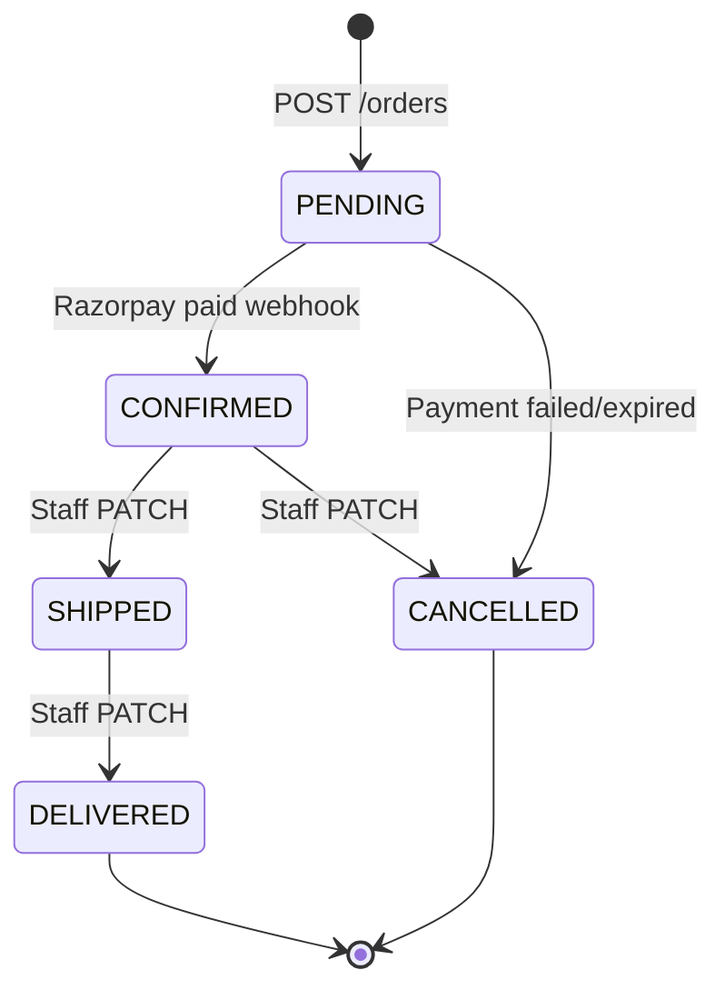

# Orders API

Checkout from frontend cart, Razorpay payment links, order tracking, and staff order management.

[← Back to index](./README.md) · [Customers](./customers.md) · [Addresses](./addresses.md) · [Payments](./payments.md) · [Invoices](./invoices.md)

---

## Overview

- **No backend cart** — the frontend stores cart items in `localStorage` and sends them at checkout
- **Server-side pricing** — totals are computed from database product prices; frontend prices are never trusted
- **Stock is decremented** atomically when the order is created
- **Stock is restored** when payment fails/expires (webhook) or staff cancels an order
- Each order gets a human-readable `orderNumber` (e.g. `ORD-20260710-0001`)
- A `Payment` record and **Razorpay Payment Link** are created at checkout
- **Order tracking timeline** — each status change is stored in `order_status_events` and exposed via `GET /orders/:id/tracking`

### Order lifecycle



Status events are recorded automatically when:
- Order is placed (`PENDING`, system)
- Payment succeeds (`CONFIRMED`, system)
- Payment fails (`CANCELLED`, system)
- Staff updates status (`STAFF` actor)

### Checkout flow

```
Frontend localStorage cart
        ↓
POST /orders (items, shippingAddressId, billingAddressId?)
        ↓
Order (PENDING) + Payment (PENDING) + stock decremented + Razorpay link
        ↓
Customer pays via paymentLinkUrl
        ↓
Razorpay webhook → Order CONFIRMED + invoice (or CANCELLED + stock restored)
```

### Order statuses

| Status | Description |
|--------|-------------|
| `PENDING` | New order, awaiting Razorpay payment |
| `CONFIRMED` | Payment received; invoice generated |
| `SHIPPED` | Order shipped |
| `DELIVERED` | Order delivered |
| `CANCELLED` | Order cancelled; stock restored |

### Payment method

All orders use `RAZORPAY`. Payment method is set server-side — not sent in the checkout request.

### Who can access?

| Endpoint | Customer | SUPER_ADMIN | ADMIN | ORDER_MANAGER |
|----------|:--------:|:-----------:|:-----:|:-------------:|
| `POST /orders` | Yes | No | No | No |
| `GET /orders` | Own orders | All (`view-orders`) | All | All |
| `GET /orders/:id` | Own order | All (`view-orders`) | All | All |
| `GET /orders/:id/tracking` | Own order | All (`view-orders`) | All | All |
| `PATCH /orders/:id` | No | Yes | Yes | Status only |

Staff `PATCH` requires `update-orders` permission.

---

## Endpoints

| Method | Endpoint | Auth | Status |
|--------|----------|------|--------|
| `POST` | `/api/v1/orders` | Customer | `201` |
| `GET` | `/api/v1/orders` | Customer or staff | `200` |
| `GET` | `/api/v1/orders/:id` | Customer or staff | `200` |
| `GET` | `/api/v1/orders/:id/tracking` | Customer or staff | `200` |
| `PATCH` | `/api/v1/orders/:id` | Staff (`update-orders`) | `200` |
| `GET` | `/api/v1/orders/:id/audit-logs` | Staff (`view-orders`) | `200` |
| `GET` | `/api/v1/orders/:id/invoice` | Customer or staff | `200` |

---

## POST /api/v1/orders

Create an order from frontend cart items. Creates a Razorpay Payment Link for the order total.

| | |
|---|---|
| **Auth** | Bearer (customer JWT) |
| **Status** | `201` |

### Request body

```json
{
  "items": [
    { "productId": 1, "quantity": 2 },
    { "productId": 3, "quantity": 1 }
  ],
  "shippingAddressId": 1,
  "billingAddressId": 2
}
```

| Field | Type | Required | Rules |
|-------|------|----------|-------|
| `items` | array | Yes | Min 1 item |
| `items[].productId` | integer | Yes | Must exist and be active |
| `items[].quantity` | integer | Yes | Min 1, max 9999 |
| `shippingAddressId` | integer | Yes | Customer's own address |
| `billingAddressId` | integer | No | Defaults to `shippingAddressId` |

### Validation rules

1. All addresses must belong to the authenticated customer
2. All products must exist and be `isActive: true`
3. Sufficient stock for each line item
4. `totalAmount` computed server-side from product prices
5. Razorpay Payment Link created using shipping address phone/name for customer prefill

### Success response

```json
{
  "success": true,
  "data": {
    "id": 1,
    "orderNumber": "ORD-20260710-0001",
    "customerId": 1,
    "addressId": 1,
    "billingAddressId": 2,
    "status": "PENDING",
    "totalAmount": "49999.98",
    "paymentMethod": "RAZORPAY",
    "shippingAddress": "123 Main Street, Apt 4B, Mumbai, Maharashtra, 400001, IN",
    "billingAddress": "456 Business Park, Mumbai, Maharashtra, 400002, IN",
    "createdAt": "2026-07-10T12:00:00.000Z",
    "updatedAt": "2026-07-10T12:00:00.000Z",
    "customer": {
      "id": 1,
      "phone": "+919876543210",
      "lastLogin": "2026-07-10T11:00:00.000Z"
    },
    "items": [
      {
        "id": 1,
        "productId": 1,
        "quantity": 2,
        "price": "24999.99",
        "product": {
          "id": 1,
          "name": "Oak Dining Table",
          "slug": "oak-dining-table"
        }
      }
    ],
    "payment": {
      "id": 1,
      "amount": "49999.98",
      "status": "PENDING",
      "paymentMethod": "RAZORPAY",
      "paymentLinkUrl": "https://rzp.io/i/xxxx",
      "razorpayPaymentLinkId": "plink_xxxxxxxx",
      "razorpayPaymentId": null,
      "transactionId": null,
      "notes": null,
      "createdAt": "2026-07-10T12:00:00.000Z",
      "updatedAt": "2026-07-10T12:00:00.000Z"
    }
  }
}
```

### Errors

| Status | When |
|--------|------|
| `400` | Invalid payload, inactive product, or insufficient stock |
| `401` | Missing or invalid token |
| `403` | Staff token used (customer access required) |
| `404` | Address not found |
| `500` | Razorpay link creation failed (order cancelled, stock restored) |

### cURL

```bash
curl -X POST http://localhost:5000/api/v1/orders \
  -H "Authorization: Bearer $CUSTOMER_TOKEN" \
  -H "Content-Type: application/json" \
  -d '{
    "items": [{ "productId": 1, "quantity": 1 }],
    "shippingAddressId": 1
  }'
```

---

## GET /api/v1/orders

List orders with pagination.

| | |
|---|---|
| **Auth** | Bearer (customer or staff JWT) |
| **Status** | `200` |

### Query parameters

| Param | Type | Default | Description |
|-------|------|---------|-------------|
| `page` | integer | `1` | Page number |
| `limit` | integer | `10` | Items per page (max 100) |
| `status` | string | — | Filter by order status |
| `customerId` | integer | — | Staff only — filter by customer |

> Customers always see only their own orders. `customerId` is ignored for customer tokens.

### Success response

```json
{
  "success": true,
  "data": {
    "items": [ ],
    "meta": {
      "page": 1,
      "limit": 10,
      "total": 1,
      "totalPages": 1
    }
  }
}
```

### cURL

```bash
# Customer — own orders
curl "http://localhost:5000/api/v1/orders?status=PENDING" \
  -H "Authorization: Bearer $CUSTOMER_TOKEN"

# Staff — all orders
curl "http://localhost:5000/api/v1/orders?customerId=1" \
  -H "Authorization: Bearer $STAFF_TOKEN"
```

---

## GET /api/v1/orders/:id

Get a single order with items, payment, and customer details.

| | |
|---|---|
| **Auth** | Bearer (customer or staff JWT) |
| **Status** | `200` |

Customers can only access their own orders.

### Errors

| Status | When |
|--------|------|
| `404` | Order not found (or not owned by customer) |

### cURL

```bash
curl http://localhost:5000/api/v1/orders/1 \
  -H "Authorization: Bearer $CUSTOMER_TOKEN"
```

---

## GET /api/v1/orders/:id/tracking

Customer-facing order tracking timeline with step-by-step progress from order placed through delivery.

| | |
|---|---|
| **Auth** | Bearer (customer or staff JWT) |
| **Status** | `200` |

Customers can only access their own orders. Staff require `view-orders`.

### Success response

```json
{
  "success": true,
  "data": {
    "orderId": 1,
    "orderNumber": "ORD-20260711-0001",
    "currentStatus": "SHIPPED",
    "paymentStatus": "COMPLETED",
    "timeline": [
      {
        "status": "PENDING",
        "label": "Order placed",
        "description": "Waiting for payment",
        "isCompleted": true,
        "isCurrent": false,
        "occurredAt": "2026-07-11T12:05:00.000Z"
      },
      {
        "status": "CONFIRMED",
        "label": "Payment confirmed",
        "description": "Order is being prepared",
        "isCompleted": true,
        "isCurrent": false,
        "occurredAt": "2026-07-11T12:08:00.000Z"
      },
      {
        "status": "SHIPPED",
        "label": "Shipped",
        "description": "Order is on the way",
        "isCompleted": true,
        "isCurrent": true,
        "occurredAt": "2026-07-11T14:00:00.000Z"
      },
      {
        "status": "DELIVERED",
        "label": "Delivered",
        "description": "Order completed",
        "isCompleted": false,
        "isCurrent": false,
        "occurredAt": null
      }
    ]
  }
}
```

### Timeline step fields

| Field | Description |
|-------|-------------|
| `status` | `PENDING`, `CONFIRMED`, `SHIPPED`, `DELIVERED`, or `CANCELLED` |
| `label` | Customer-friendly step title |
| `description` | Short explanation for the storefront UI |
| `isCompleted` | Step has been reached |
| `isCurrent` | Active step right now |
| `occurredAt` | ISO timestamp when this status was recorded, or `null` |

### Storefront integration

- Poll `GET /orders/:id/tracking` every 3–5 seconds while `currentStatus === 'PENDING'` after Razorpay redirect
- Render a vertical stepper: completed steps, highlighted current step, grey future steps
- Use `paymentStatus` to show payment state alongside the timeline

### cURL

```bash
curl http://localhost:5000/api/v1/orders/1/tracking \
  -H "Authorization: Bearer $CUSTOMER_TOKEN"
```

---

## PATCH /api/v1/orders/:id

Staff order update with audit logging. **ADMIN** and **SUPER_ADMIN** can perform full corrections; **ORDER_MANAGER** can update **status only**.

| | |
|---|---|
| **Auth** | Bearer (staff JWT) |
| **Permission** | `update-orders` |
| **Status** | `200` |

### Role matrix

| Field | ADMIN / SUPER_ADMIN | ORDER_MANAGER |
|-------|---------------------|---------------|
| `status` | Yes | Yes |
| `shippingAddressId`, `billingAddressId` | Yes | No (`403`) |
| `items[]` | Yes | No |
| `payment.notes` | Yes | No |

### Request body

All fields optional; at least one required.

```json
{
  "status": "SHIPPED",
  "shippingAddressId": 1,
  "billingAddressId": 2,
  "items": [
    { "productId": 1, "quantity": 2 }
  ],
  "payment": {
    "notes": "Gift wrap requested"
  }
}
```

| Field | Type | Rules |
|-------|------|-------|
| `status` | string | Valid transitions enforced (e.g. `PENDING` → `CONFIRMED` → `SHIPPED` → `DELIVERED`) |
| `shippingAddressId` | integer | Must belong to order customer; refreshes address snapshot |
| `billingAddressId` | integer | Must belong to order customer |
| `items` | array | Min 1 item; prices from DB; stock adjusted by delta |
| `payment.notes` | string | Staff notes on payment record |

### Restrictions

- Cannot edit `customerId`, `orderNumber`, `paymentMethod`, or Razorpay IDs
- Cannot edit items/addresses on `CANCELLED` or `DELIVERED` orders
- Cannot change items and cancel in the same request

### Side effects

| Change | Effect |
|--------|--------|
| → `CONFIRMED` | Invoice generated (idempotent) |
| → `CANCELLED` | Stock restored for all line items |
| `items` changed on confirmed order with invoice | Invoice regenerated |
| `items` changed | `totalAmount` and `payment.amount` recalculated; stock delta applied |

### Audit

All field changes are written to the audit log. See [admin-audit-logs.md](./admin-audit-logs.md) and `GET /orders/:id/audit-logs`.

### Staff detail fields

Staff `GET /orders/:id` includes `shippingAddressRef`, `billingAddressRef`, `invoice` summary, `customer.isActive`, and `payment.gatewayPayload`.

### cURL

```bash
curl -X PATCH http://localhost:5000/api/v1/orders/1 \
  -H "Authorization: Bearer $STAFF_TOKEN" \
  -H "Content-Type: application/json" \
  -d '{"status":"SHIPPED"}'
```

---

## GET /api/v1/orders/:id/audit-logs

Paginated audit history for the order, line items, and payment notes. Requires `view-orders`.

---

## Frontend integration notes

### localStorage cart shape (suggested)

```json
[
  { "productId": 1, "quantity": 2, "name": "Oak Table", "price": "24999.99" }
]
```

Only `productId` and `quantity` are sent to the API. Name and price in localStorage are for display only.

### Minimal checkout sequence

```javascript
// 1. Send OTP then verify
await sendOtp(phone);
const { accessToken } = await verifyOtp(phone, otp);

// 2. Read cart from localStorage
const cart = JSON.parse(localStorage.getItem('cart') || '[]');

// 3. Checkout
const response = await fetch('/api/v1/orders', {
  method: 'POST',
  headers: {
    Authorization: `Bearer ${accessToken}`,
    'Content-Type': 'application/json',
  },
  body: JSON.stringify({
    items: cart.map(({ productId, quantity }) => ({ productId, quantity })),
    shippingAddressId: selectedShippingId,
    billingAddressId: selectedBillingId, // optional
  }),
});
const { data: order } = await response.json();

// 4. Redirect customer to Razorpay payment link
window.location.href = order.payment.paymentLinkUrl;

// 5. Clear cart after successful checkout response (before redirect)
localStorage.removeItem('cart');
```

See [payments.md](./payments.md) for webhook behaviour and polling payment status.
