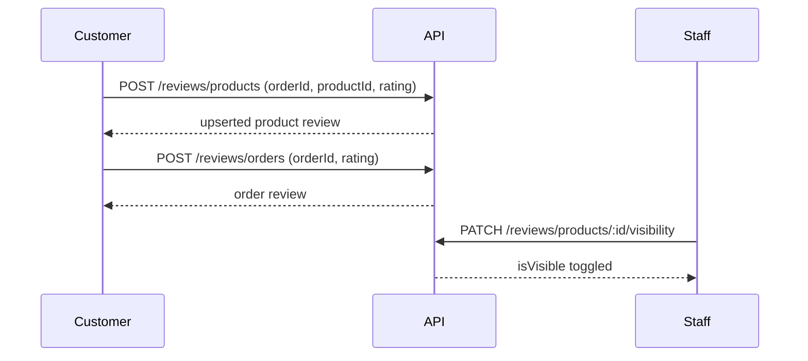

# Reviews API

Product ratings/reviews and overall order reviews for delivered purchases.

[← Back to index](./README.md) · [Customers](./customers.md) · [Orders](./orders.md) · [Products](./products.md)

---

## Overview

- Customers may review **only after** an order is `DELIVERED`
- **Product review:** product must appear on that delivered order; one review per customer + product (create upserts)
- **Order review:** one review per order (create updates if already exists)
- Public storefront shows only reviews with `isVisible: true`
- Staff can list and hide/show reviews (`view-reviews`, `moderate-reviews`)



### Permissions

| Permission | Roles |
|------------|-------|
| `view-reviews` | SUPER_ADMIN, ADMIN, ORDER_MANAGER |
| `moderate-reviews` | SUPER_ADMIN, ADMIN |

---

## Endpoints

| Method | Endpoint | Auth | Access |
|--------|----------|------|--------|
| `POST` | `/api/v1/reviews/products` | Customer | Own delivered order item |
| `PATCH` | `/api/v1/reviews/products/:id` | Customer | Own review |
| `DELETE` | `/api/v1/reviews/products/:id` | Customer | Own review |
| `POST` | `/api/v1/reviews/orders` | Customer | Own delivered order |
| `PATCH` | `/api/v1/reviews/orders/:id` | Customer | Own review |
| `DELETE` | `/api/v1/reviews/orders/:id` | Customer | Own review |
| `GET` | `/api/v1/products/:productId/reviews` | Public | Visible reviews only |
| `GET` | `/api/v1/users/me/reviews` | Customer | Own product + order reviews |
| `GET` | `/api/v1/reviews` | Staff | `view-reviews` |
| `PATCH` | `/api/v1/reviews/products/:id/visibility` | Staff | `moderate-reviews` |
| `PATCH` | `/api/v1/reviews/orders/:id/visibility` | Staff | `moderate-reviews` |

---

## POST /api/v1/reviews/products

Create or update a product review for an item on a delivered order.

| | |
|---|---|
| **Auth** | Bearer (customer) |
| **Status** | `201` |

### Request body

```json
{
  "orderId": 12,
  "productId": 3,
  "rating": 5,
  "comment": "Solid build and looks great."
}
```

| Field | Type | Required | Rules |
|-------|------|----------|-------|
| `orderId` | integer | Yes | Must be owned and `DELIVERED` |
| `productId` | integer | Yes | Must be a line item on that order |
| `rating` | integer | Yes | `1`–`5` |
| `comment` | string | No | Max 2000 chars |

### Errors

| Status | When |
|--------|------|
| `404` | Order not found / not owned |
| `400` | Order not delivered, or product not on order |

---

## POST /api/v1/reviews/orders

Create or update an overall order review.

```json
{
  "orderId": 12,
  "rating": 4,
  "comment": "Delivery was on time."
}
```

---

## GET /api/v1/products/:productId/reviews

Public visible reviews with average rating.

### Success response

```json
{
  "success": true,
  "data": {
    "items": [
      {
        "id": 1,
        "rating": 5,
        "comment": "Solid build and looks great.",
        "customer": { "id": 1, "phone": "******3210" },
        "createdAt": "2026-07-14T10:00:00.000Z",
        "updatedAt": "2026-07-14T10:00:00.000Z"
      }
    ],
    "meta": {
      "page": 1,
      "limit": 10,
      "total": 1,
      "totalPages": 1,
      "ratingAverage": 5,
      "reviewCount": 1
    }
  }
}
```

Phone numbers are masked in public and customer-facing review payloads.

---

## GET /api/v1/reviews (staff)

Query params: `kind` (`product` \| `order`, default `product`), `productId`, `orderId`, `customerId`, `isVisible`, `page`, `limit`.

---

## PATCH …/visibility (staff)

```json
{
  "isVisible": false
}
```

Hidden reviews are excluded from public product pages and `ratingAverage` / `reviewCount` on `GET /products/:id`.

---

## Product detail enrichment

`GET /api/v1/products/:id` includes:

| Field | Type |
|-------|------|
| `ratingAverage` | number \| null |
| `reviewCount` | integer |

Also see [customers.md](./customers.md) for `GET /users/me/reviews`.
