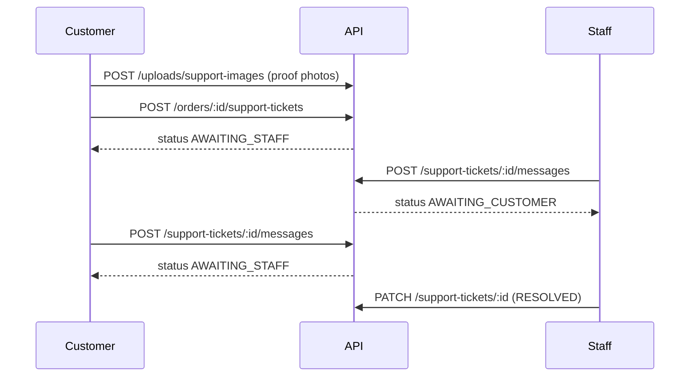

# Order Support API

Customer support tickets against orders — questions, problem reports with proof images, and staff-driven follow-up.

[← Back to index](./README.md) · [Orders](./orders.md) · [Uploads](./uploads.md)

---

## Overview

Customers can open a **support ticket** on their own order to ask a question or report a problem. Proof images are uploaded separately to R2, then attached when creating the ticket or replying.

Support is **threaded**, but **customer replies are staff-driven**:

1. Customer creates a ticket with an initial message (and images for problems).
2. Staff reviews and can post follow-up questions.
3. Customer may reply **only when** ticket status is `AWAITING_CUSTOMER`.
4. Staff resolves or closes the ticket.



### Ticket types

| Type | Description |
|------|-------------|
| `QUESTION` | General question about the order (images optional) |
| `PROBLEM` | Issue report — **at least one proof image required** |

### Ticket statuses

| Status | Description |
|--------|-------------|
| `OPEN` | Created (transitions immediately to `AWAITING_STAFF` on first message) |
| `AWAITING_STAFF` | Waiting for staff action |
| `AWAITING_CUSTOMER` | Staff asked a question; customer may reply |
| `RESOLVED` | Issue handled |
| `CLOSED` | Ticket closed (no further updates) |

### Who can access?

| Endpoint | Customer | SUPER_ADMIN | ADMIN | ORDER_MANAGER |
|----------|:--------:|:-----------:|:-----:|:-------------:|
| `POST /uploads/support-images` | Yes | No | No | No |
| `POST /uploads/support-images/batch` | Yes | No | No | No |
| `POST /orders/:orderId/support-tickets` | Own order | No | No | No |
| `GET /orders/:orderId/support-tickets` | Own order | No | No | No |
| `GET /support-tickets/:id` | Own ticket | Yes | Yes | Yes |
| `POST /support-tickets/:id/messages` | Own ticket (when `AWAITING_CUSTOMER`) | Yes | Yes | Yes |
| `GET /support-tickets` | No | Yes | Yes | Yes |
| `PATCH /support-tickets/:id` | No | Yes | Yes | Yes |

Staff list/detail/message/update require `view-order-support` / `update-order-support` permissions.

Tickets cannot be created for **cancelled** orders.

---

## Proof image upload flow

Same two-phase pattern as product images:

1. **Upload** via `POST /uploads/support-images` (or `/batch`, max 5 files)
2. **Attach** `url` + `storageKey` in ticket create or message body

Images are processed to WebP (max ~500 KB output per file). See [uploads.md](./uploads.md) for R2 environment variables.

```bash
curl -X POST http://localhost:5000/api/v1/uploads/support-images \
  -H "Authorization: Bearer <customer-jwt>" \
  -F "file=@damage.jpg"
```

---

## Endpoints

| Method | Endpoint | Auth | Status |
|--------|----------|------|--------|
| `POST` | `/api/v1/uploads/support-images` | Customer | `201` |
| `POST` | `/api/v1/uploads/support-images/batch` | Customer | `201` |
| `POST` | `/api/v1/orders/:orderId/support-tickets` | Customer | `201` |
| `GET` | `/api/v1/orders/:orderId/support-tickets` | Customer | `200` |
| `GET` | `/api/v1/support-tickets` | Staff | `200` |
| `GET` | `/api/v1/support-tickets/:id` | Customer or staff | `200` |
| `POST` | `/api/v1/support-tickets/:id/messages` | Customer or staff | `201` |
| `PATCH` | `/api/v1/support-tickets/:id` | Staff | `200` |

---

## POST /api/v1/orders/:orderId/support-tickets

Create a support ticket with an initial customer message.

| | |
|---|---|
| **Auth** | Bearer (customer JWT) |
| **Status** | `201` |

### Request body

```json
{
  "type": "PROBLEM",
  "subject": "Damaged chair leg",
  "message": "One leg arrived cracked during delivery.",
  "attachments": [
    {
      "url": "https://cdn.example.com/support-tickets/2026/07/abc.webp",
      "storageKey": "support-tickets/2026/07/abc.webp",
      "sortOrder": 0
    }
  ]
}
```

| Field | Type | Required | Rules |
|-------|------|----------|-------|
| `type` | string | Yes | `QUESTION` \| `PROBLEM` |
| `subject` | string | Yes | Max 120 chars |
| `message` | string | Yes | Max 2000 chars |
| `attachments` | array | No | Max 5 items; **required for `PROBLEM`** |

### Success response `201`

```json
{
  "success": true,
  "data": {
    "id": 1,
    "ticketNumber": "SUP-20260713-0001",
    "orderId": 7,
    "customerId": 3,
    "type": "PROBLEM",
    "subject": "Damaged chair leg",
    "status": "AWAITING_STAFF",
    "order": {
      "id": 7,
      "orderNumber": "ORD-20260713-0001",
      "status": "DELIVERED"
    },
    "messages": [
      {
        "id": 1,
        "authorType": "CUSTOMER",
        "authorId": 3,
        "body": "One leg arrived cracked during delivery.",
        "createdAt": "2026-07-13T10:00:00.000Z",
        "attachments": [
          {
            "id": 1,
            "url": "https://cdn.example.com/support-tickets/2026/07/abc.webp",
            "storageKey": "support-tickets/2026/07/abc.webp",
            "sortOrder": 0
          }
        ]
      }
    ],
    "createdAt": "2026-07-13T10:00:00.000Z",
    "updatedAt": "2026-07-13T10:00:00.000Z"
  }
}
```

### Errors

| Status | When |
|--------|------|
| `400` | Cancelled order, `PROBLEM` without images, validation failure |
| `403` | Order does not belong to customer |
| `404` | Order not found |

---

## GET /api/v1/orders/:orderId/support-tickets

List support tickets for a specific order (customer's own order only).

### Success response `200`

```json
{
  "success": true,
  "data": {
    "items": [
      {
        "id": 1,
        "ticketNumber": "SUP-20260713-0001",
        "orderId": 7,
        "customerId": 3,
        "type": "PROBLEM",
        "subject": "Damaged chair leg",
        "status": "AWAITING_STAFF",
        "order": {
          "id": 7,
          "orderNumber": "ORD-20260713-0001",
          "status": "DELIVERED"
        },
        "lastMessageAt": "2026-07-13T10:00:00.000Z",
        "createdAt": "2026-07-13T10:00:00.000Z",
        "updatedAt": "2026-07-13T10:00:00.000Z"
      }
    ]
  }
}
```

---

## GET /api/v1/support-tickets

Staff paginated list of all support tickets.

### Query parameters

| Param | Type | Description |
|-------|------|-------------|
| `status` | string | Filter by ticket status |
| `type` | string | `QUESTION` \| `PROBLEM` |
| `orderId` | integer | Filter by order |
| `customerId` | integer | Filter by customer |
| `q` | string | Search ticket number or subject |
| `page` | number | Default `1` |
| `limit` | number | Default `10`, max `100` |

Staff list items include `customer: { id, phone }`.

---

## GET /api/v1/support-tickets/:id

Ticket detail with full message thread. Customers see only their own tickets.

---

## POST /api/v1/support-tickets/:id/messages

Add a message to an existing ticket.

### Customer reply

Allowed only when `status === AWAITING_CUSTOMER`.

```json
{
  "message": "Here is the close-up photo you requested.",
  "attachments": [
    {
      "url": "https://cdn.example.com/support-tickets/2026/07/def.webp",
      "storageKey": "support-tickets/2026/07/def.webp"
    }
  ]
}
```

### Staff message

```json
{
  "message": "Please share a close-up photo of the damaged area.",
  "awaitingCustomer": true
}
```

| Field | Type | Notes |
|-------|------|-------|
| `awaitingCustomer` | boolean | Staff only. Default `true` → sets status to `AWAITING_CUSTOMER`. Set `false` to keep `AWAITING_STAFF`. |

### Errors

| Status | When |
|--------|------|
| `400` | Customer reply when status is not `AWAITING_CUSTOMER`; closed ticket |
| `403` | Customer accessing another customer's ticket |
| `404` | Ticket not found |

---

## PATCH /api/v1/support-tickets/:id

Resolve or close a ticket (staff only).

```json
{
  "status": "RESOLVED",
  "resolutionNote": "Replacement part shipped. Ticket resolved."
}
```

| Field | Type | Required | Rules |
|-------|------|----------|-------|
| `status` | string | Yes | `RESOLVED` \| `CLOSED` |
| `resolutionNote` | string | No | Max 2000 chars; stored as a staff message |

Closed tickets cannot be updated.

---

## Frontend integration checklist

1. On order detail page, show **Get help** / **Report problem** CTA.
2. For problems, upload images first (`POST /uploads/support-images/batch`).
3. Create ticket with `POST /orders/:orderId/support-tickets`.
4. Poll or refresh `GET /support-tickets/:id` to show thread.
5. Enable reply UI only when `status === AWAITING_CUSTOMER`.

---

## Related

- [Orders](./orders.md) — order lifecycle and ownership
- [Uploads](./uploads.md) — R2 image upload configuration
